# Projeto  BiblioConecta

O BiblioConecta é um aplicativo criado para que o usuário consiga de forma prática e intuitiva organizar e gerenciar livros. 

O aplicativo permite criar “estantes” para que livros possam ser agrupados de acordo as necessidades do usuário. Os livros são cadastrados pelo número ISBN ou pela leitura do código de barras feita pela câmera do celular. O BiblioConecta também permite adicionar uma descrição, favoritar e classificar o livro como lido, além de permitir o compartilhamento das estantes criadas e adicionar metas de leitura.

## Índice
 

- [Instalação](#nome1)
- [Funcionalidades do Projeto](#nome2)
- [Layout](#nome3)
- [Demonstração](#nome4)
- [Próximos Passos](#nome5)
- [Autoras](#nome6)

## ⚙️ <a id="nome1">Instalação</a>

Existem duas formas de instalação do aplicativo:
1)	Instalação e execução via Android por meio do <a href="https://github.com/caiiibr/biblioConecta/blob/ecf2fa3f3e33a2f19451fb5979b92b1b5a09a118/dist/com.biblioconecta.apk">arquivo.apk</a>
- Realizar o download do arquivo;
- Habilitar permissão para instalar aplicativos desconhecidos no celular;

2)	Instalação e execução pelo Visual Studio (Windows)
- Fazer download do Visual Studio versão para comunidade disponível neste link : https://visualstudio.microsoft.com/pt-br/downloads/;
- Instalar o Visual Studio e durante a instalação é obrigatório marcar a opção “.NET Multi-plataform App UI development”;
- Depois de concluída a instalação abrir o Visual Studio e ir na opção “clonar repositório” e informar o endereço do repositório git;
- Depois de clonado o projeto, mudar a forma de execução na barra de tarefas do Visual Studio para ‘Android’ ou para o nome de alguma máquina virtual do Android e executar posteriormente.

## 📲 <a id="nome2">Funcionalidades do Projeto</a>

- [x] Cadastro Usuário
- [x] Login
- [x] Cadastro de Prateleiras
- [x] Cadastro de Livros
- [x] Livros Favoritos
- [x] Compartilhamento de Prateleiras
- [x] Metas de Leitura
- [x] Informações do Usuário

## 📰 <a id="nome3">Layout</a>

### Tela de Início

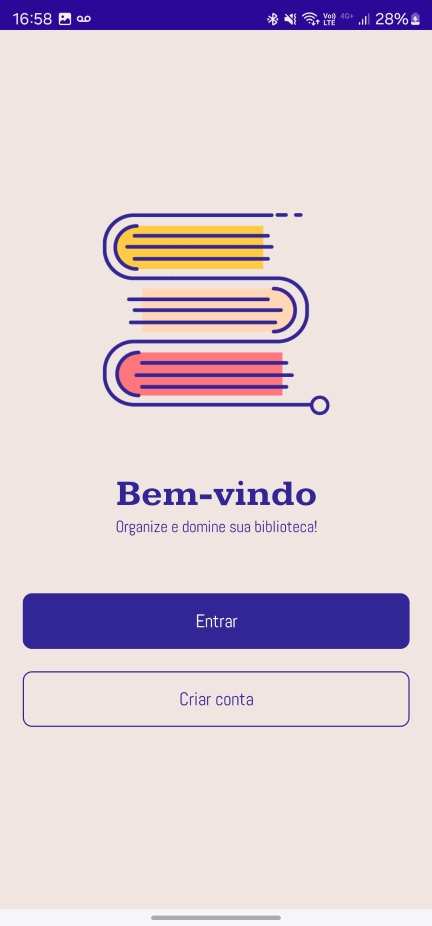

### Cadastro de Usuário
O cadastro do usuário é feito de forma simples, sendo necessário apenas o nome, e-mail e a criação de uma senha.

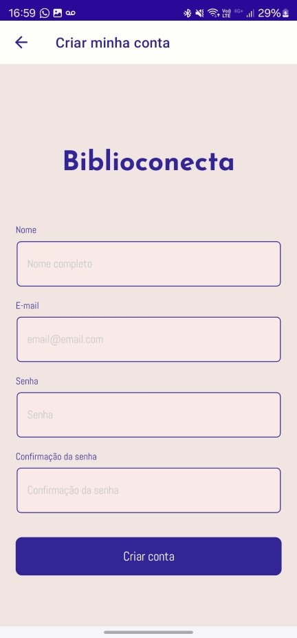

### Login

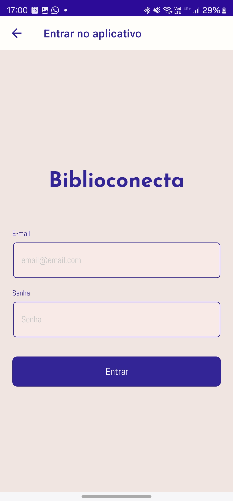

### Mensagem Inicial
Ao entrar no aplicativo um breve tutorial de uso é fornecido ao usuário.

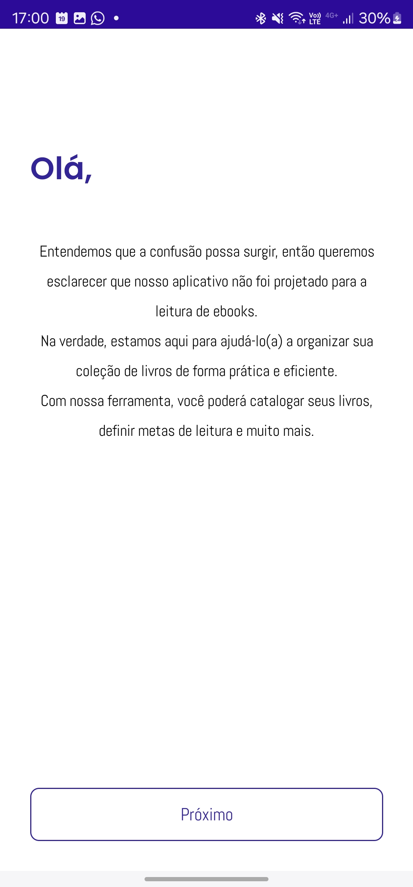 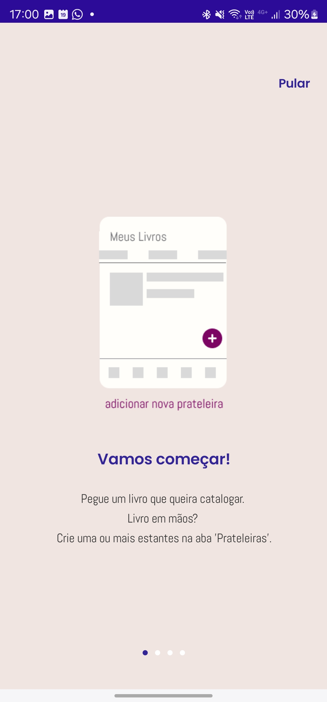

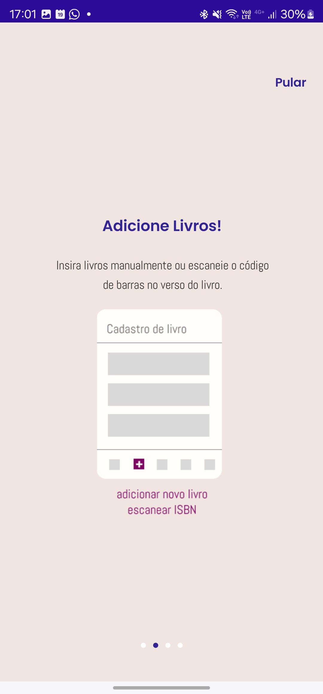 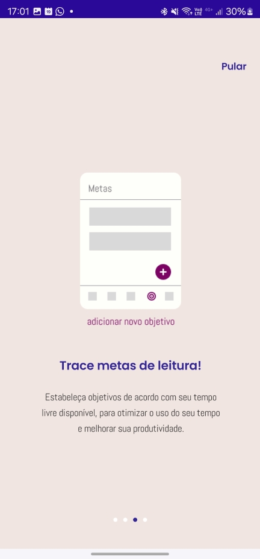

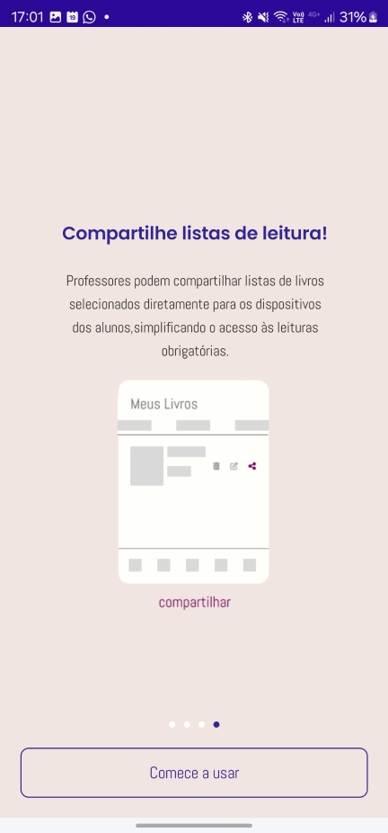

### Layout Inicial
O layout inicial mostra uma de forma prática as diferentes formas de agrupamento: prateleiras de livros, todos os livros e livros favoritos. As formas de cadastro estão indicadas na parte inferior com as funcionalidades: prateleiras, livros e o escaneamento do ISBN pelo código e barras. Na parte inferior ainda são apresentadas as funcionalidades de criação de meta e alterações de pessoais de login do aplicativo.

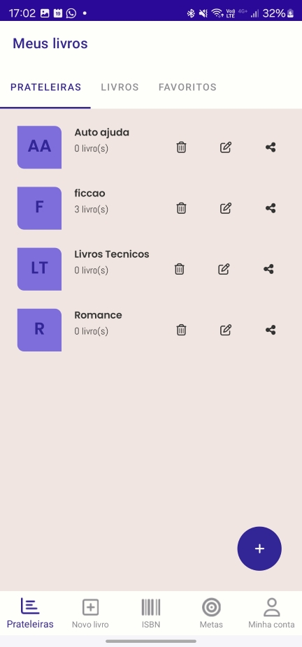

## 🕹️ <a id="nome4">Demonstração</a>

[Vídeo Demonstrativo](https://youtu.be/hsT9QpYC3Qk?si=xe38TLcKPS4ohVqh)

### Cadastro de Prateleiras
Na aba "Prateleiras" ao selecionar o ícone "+" uma janela irá se abrir para nomear a prateleira.

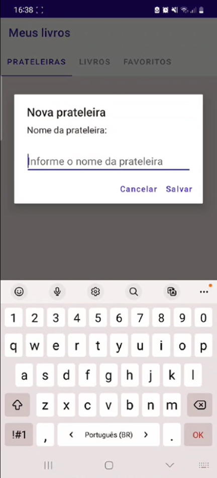

### Cadastro Livros
Na aba "Livros", inicia-se com a seleção da prateleira na qual se deseja adicionar um livro. Ao selecionar o ícone "+" para adicionar um livro em sua prateleira, o livro deve ser cadastrado com o número do ISBN que pode ser preenchido manualmente ou clicando na lupa que utilizará a câmera do celular para ler o código de barras e identificar o ISBN.

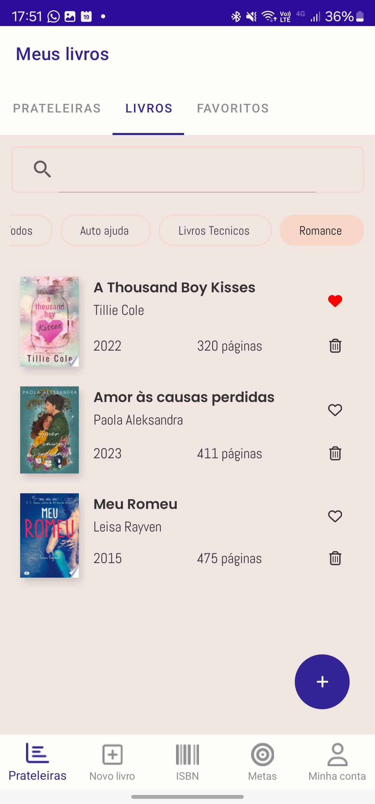

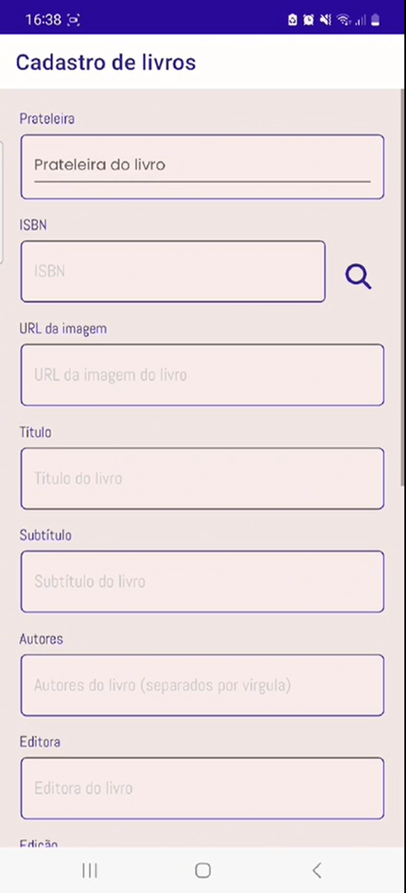

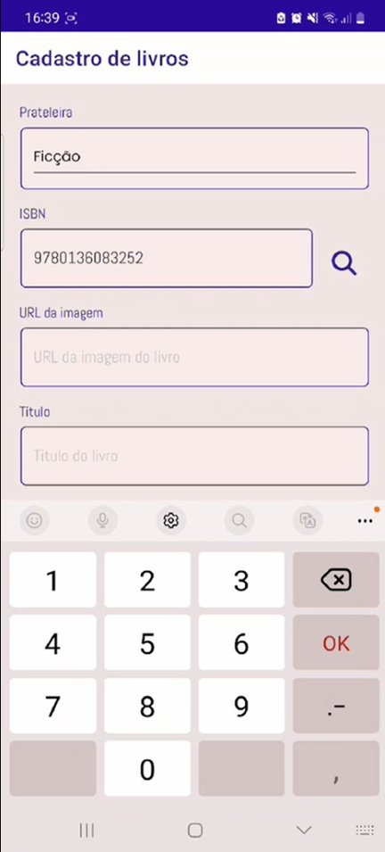

### Favoritos e Lidos
Ao final do cadastro do livro há a opção de favoritar o livro e informar se o livro já foi lido. Pode-se também favoritar o livro após o cadastro clicando no ícone de coração.

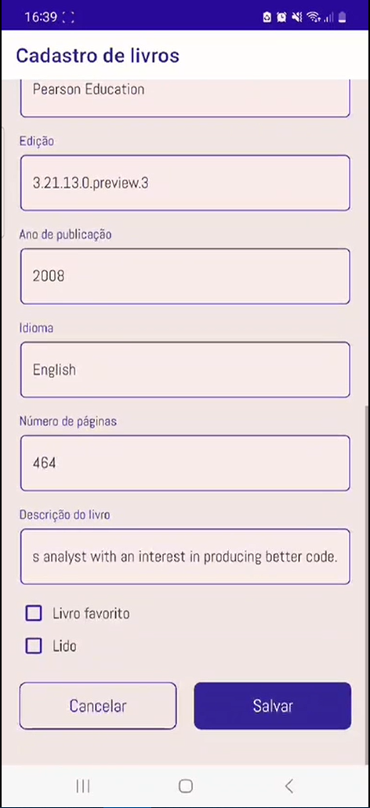

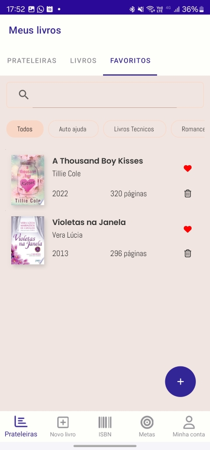

### Compartilhando Prateleiras

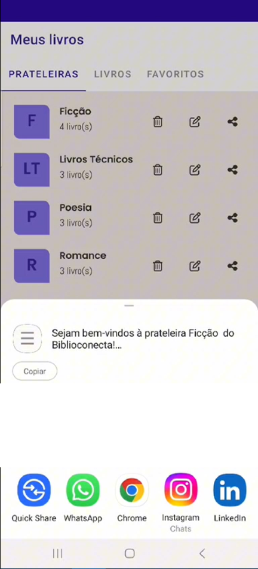

### Criando Metas

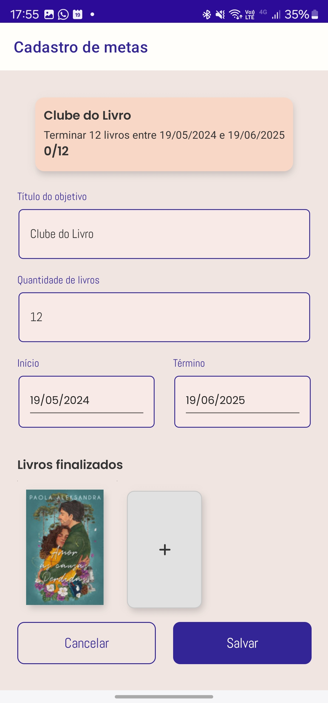 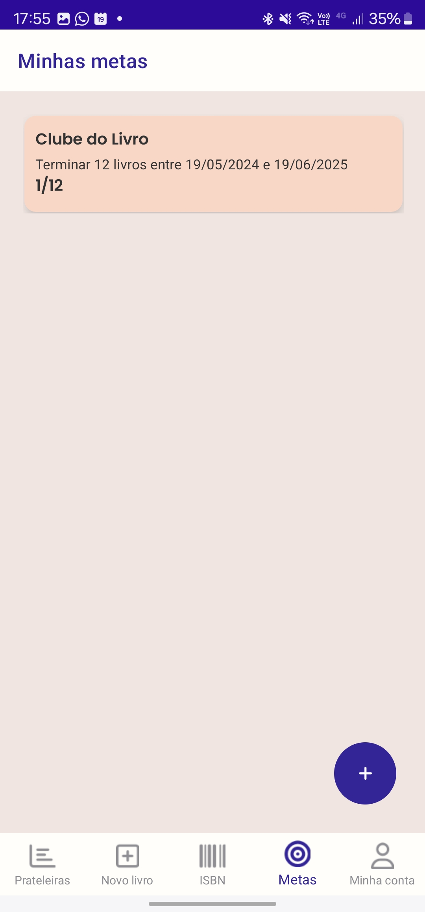

### Minha Conta

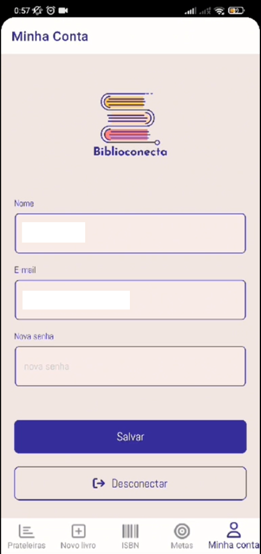

## 🛠️ <a id="nome5">Próximos Passos</a>

- [ ] Adicionar filtros avançados.
- [ ] Otimizar seleção de prateleiras.
- [ ] Adicionar capas de livros por meio de foto tirada pelo celular ou imagens da galeria.

## 👩‍💻 <a id="nome6">Autoras</a>

<a href="https://github.com/anamoraeslima">Ana Caroline de Moraes Lima</a>

<a href="https://github.com/ellen-moura">Ellen Cristina Germano de Moura</a>

<a href="https://github.com/WalVasconcelos">Walberlena dos Anjos Vasconcelos</a>

<a href="https://github.com/caiiibr">Camila Fernanda dos Santos Matos</a>

<a href="https://github.com/marigic">Mariana Gomes Ibiapina Calado</a>

<a href="https://github.com/ThaisYamazaki">Thais Yumi Yamazaki</a>
