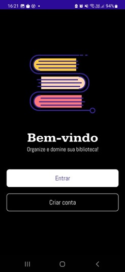
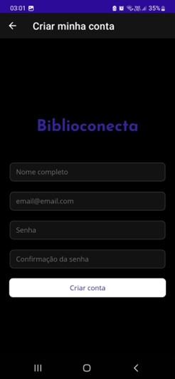
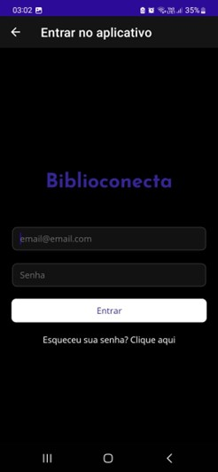

# Projeto  BiblioConecta

O BiblioConecta é um aplicativo criado para que o usuário consiga de forma prática e intuitiva organizar e gerenciar livros. 

O aplicativo permite criar “estantes” para que livros possam ser agrupados de acordo as necessidades do usuário. Os livros são cadastrados pelo número ISBN ou pela leitua do código de barras feita pela câmera do celuar. O BiblioConecta também permite adicionar uma descrição, favoritar e classificar o livro como lido, além de permitir o compartilhamento das estantes criadas e adicionar metas de leitura.

## Índice
 

- [Instalação](#nome1)
- [Funcionalidades do Projeto](#nome2)
- [Layout](#nome3)
- [Demonstração](#nome4)
- [Próximos Passos](#nome5)
- [Autoras](#nome6)

## ⚙️ <a id="nome1">Instalação</a>

Existem duas formas de instalação do aplicativo:
1)	Instalação e execução via Android por meio do <a href="https://github.com/caiiibr/biblioConecta/blob/main/dist/com.biblioconecta.apk">arquivo.apk</a>
- Realizar o download do arquivo;
- Habilitar permissão para instalar aplicativos desconhecidos no celular;

2)	Instalação e execução pelo Visual Studio (Windows)
- Fazer download do Visual Studio versão para comunidade disponível neste link : https://visualstudio.microsoft.com/pt-br/downloads/;
- Instalar o Visual Studio e durante a instalação é obrigatório marcar a opção “.NET Multi-plataform App UI development”;
- Depois de concluída a instalação abrir o Visual Studio e ir na opção “clonar repositório” e informar o endereço do repositório git;
- Depois de clonado o projeto, mudar a forma de execução na barra de tarefas do Visual Studio para ‘Android’ ou para o nome de alguma máquina virtual do Android e executar posteriormente.

## 📲 <a id="nome2">Funcionalidades do Projeto</a>

- [x] Cadastro Usuário
- [x] Login
- [x] Cadastro de Prateleiras
- [x] Cadastro de Livros
- [x] Favoritos
- [x] Informações do Usuário

## 📰 <a id="nome3">Layout</a>

### Tela de Início

### Cadastro de Usuário
O cadastro do usuário é feito de forma simples, sendo necessário apenas o nome, e-mail e a criação de uma senha.

### Login

### Layout Inicial

## 🕹️ <a id="nome4">Demonstração</a>

[Vídeo Demonstrativo](https://www.youtube.com/watch?v=QNJEta1ZOPI)

### Cadastro de Prateleiras

Na aba "Prateleiras" ao selecionar o ícone "+" uma janela irá se abrir para nomear a prateleira.

### Cadastro Livros

Na aba "Livros", ao selecionar o ícone "+" para adicionar um livro em sua prateleira, uma janela para preencher as informações do livro irá abrir. A imagem do livro deve ser inserida por meio de um URL da imagem. Há a possibilidade de favoritar o livro e marcá-lo como lido. Ao finalizar o cadastro deve-se salvar as informações para que o livro seja devidamente cadastrado na prateleira.

Os dados utilizados neste exemplo foram:
- Categoria Auto -ajuda
- Titulo do livro:  Anti-frágil - Coisas que se beneficiam com o caos 
- Autor : Nassim Nicholas Taleb
- ISBN: 978-8547001087
- URL imagem: https://res.cloudinary.com/ddrauz5cb/image/upload/v1699987823/livros%20_cloudinary/auto-ajuda/anti-fragil_cy928w.jpg

## 🛠️ <a id="nome5">Próximos Passos</a>

- [ ] Adicionar biblioteca para que cadastro não precise ser feito de forma manual.
- [ ] Scanner para facilitar identificação de livros e cadastro.
- [ ] Disponibilizar para sistema iOS.

## 👩‍💻 <a id="nome6">Autoras</a>

<a href="https://github.com/anamoraeslima">Ana Caroline de Moraes Lima</a>

<a href="https://github.com/ellen-moura">Ellen Cristina Germano de Moura</a>

<a href="https://github.com/WalVasconcelos">Walberlena dos Anjos Vasconcelos</a>

<a href="https://github.com/caiiibr">Camila Fernanda dos Santos Matos</a>

<a href="https://github.com/marigic">Mariana Gomes Ibiapina Calado</a>

<a href="https://github.com/ThaisYamazaki">Thais Yumi Yamazaki</a>
